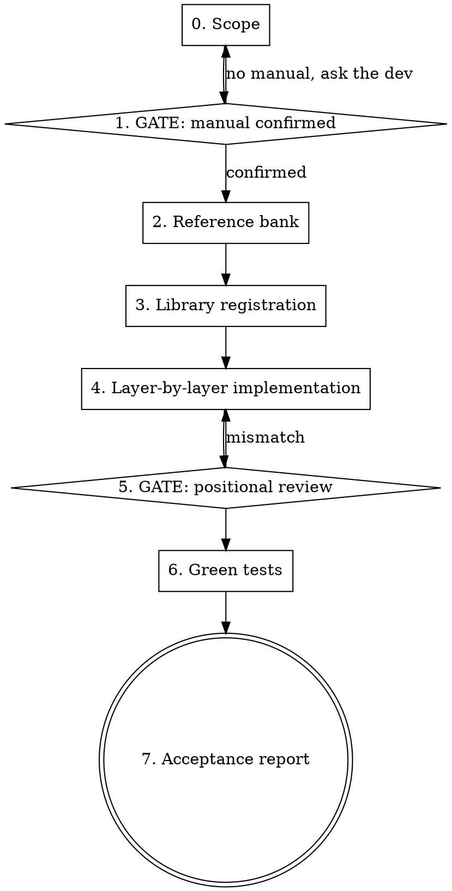

# Bank integration (collection and payment)

## Core principle

**The bank's manual is the only source of truth. No code gets written before the manual is in hand and confirmed.**

Every expensive bug in this fork's history came from one of three things: the wrong or outdated manual, a positional field assumed by analogy with another bank, or a batch counter/sequence nobody checked. This skill exists to block those three doors.

## Rule of conduct — ask until no doubt is left

**When in doubt, ask the developer. Always. As many times as it takes.**

**There is no limit on questions.** Ask, take in the answer, analyze it against the manual and the code, and if the answer opens a new doubt, ask again. The loop closes only when nothing about what you are going to write is still uncertain. One extra question costs seconds; one assumed field costs a reimplementation and a rejection in production.

Tool: `AskUserQuestion` (the 2-4 limit is on **options per question**, not on questions). One focused question at a time, offering the options you already gathered from the manual and the code. Need a free-form value (agreement number, assignor code)? Ask in prose.

Never invent, never infer by analogy: which manual to use, agreement number, wallet code, layout version, occurrence code, credit method, service type, multi-batch restrictions, date format, or whether a field is numeric or alphanumeric.

If the developer answers "I don't know", ask whether they can get it from their bank contact — and meanwhile work on whatever does **not** depend on it. Stop for real only when nothing else can move without the answer.

Don't ask what the repository or the manual can tell you. Ask what only the developer, the bank, or the consuming application knows.

## Required workflow

Create a todo for each step. Don't skip steps. Don't move past an open gate.



### 0. Scope

Before opening any file, determine and **confirm with the developer**:

| Dimension | Options |
|---|---|
| Bank | name + 3-digit clearing code |
| Domain | **collection** (receiving — boleto/remittance/return) and/or **payment** (paying — PIX/TED/boleto/taxes) |
| Layout | CNAB 400, CNAB 240, or both |
| Direction | remittance (generate), return (parse), or both |
| Operations | registration, write-off, due date change, amount change, protest, rebate, discount… |

Collection and payment are **independent domains** with separate class hierarchies. See `references/architecture.md`.

### 1. GATE — manual confirmed

1. List `manuais/<BANK>/`. If the directory is missing or empty, **stop and ask the developer for the manual**.
2. If there is more than one PDF, **ask which one to use** (`AskUserQuestion`), listing name, size and date. Never pick on your own.
3. Read the manual with the Read tool (`pages`). Extract into the scratchpad the **positional table** for every record you will implement: start position, end position, length, format (9/X, decimals), content, whether it is required.
4. Record the layout version and manual date in a comment at the top of the class.

> Banrisul was implemented twice because of this: the code was written against the `v10.3` manual (payments) when collection uses `240_posicoes.pdf`. Confirming which manual costs one question; getting it wrong costs a reimplementation.

**Do not pass this gate with:** "the manual is probably like bank X's", "I'll follow the FEBRABAN standard", "the PDF isn't readable, I'll infer it". If the PDF is unreadable, ask the developer for the field table as text.

### 2. Reference bank

Pick the closest already-implemented bank (same cooperative network, same layout, same processor) and **justify the choice in writing**. It serves as a **structural** template — method names, ordering, style. **Never copy positions or codes**: those come from the manual, field by field.

### 3. Library registration

Every new bank needs these, or it fails at runtime in non-obvious ways. See `references/architecture.md` for the detail of each.

- [ ] `COD_BANCO_<X>` in `src/Contracts/Boleto/Boleto.php` **and** `src/Contracts/Pagamento/Pagamento.php`
- [ ] `$aBancos` map in `src/Util.php` (used by the return-file factory)
- [ ] `Util::controlePmisto` (two `switch` blocks) if tests will generate a fake return from the remittance
- [ ] `src/CalculoDV.php` — check digit for "nosso número" / account / branch, when the bank has its own rule
- [ ] `logos/<code>.png` — required for boleto rendering
- [ ] A trait in `src/Cnab/Remessa/Traits/` when there is a reusable rule (e.g. "nosso número" range validation)

### 4. Layer-by-layer implementation

One layer at a time, in order. Each layer compiles and has tests before the next one starts.

**Collection:** `Boleto/Banco/X.php` → `Cnab/Remessa/Cnab400|240/Banco/X.php` → `Cnab/Retorno/Cnab400|240/Banco/X.php`
**Payment:** `Cnab/Pagamento/Cnab240/Banco/X.php` → `Cnab/Pagamento/Retorno/Cnab240/Banco/X.php`

Read the layer's reference **before** writing:

| Layer | Reference |
|---|---|
| Boleto + collection remittance | `references/collection-remittance.md` |
| Collection return | `references/collection-return.md` |
| Payment remittance | `references/payment-remittance.md` |
| Payment return | `references/payment-return.md` |
| Always, before closing a layer | `references/attention-points.md` — accumulated acceptance criteria |

**Readability standard (non-negotiable):**
- A named constant for every code from the manual — `const OCORRENCIA_PEDIDO_BAIXA = '02';`, never a bare `'02'`.
- A docblock explaining the **why** whenever a field has a non-obvious rule, citing the position and the manual section.
- A field the layout cannot carry: `ValidationException` with a message that says what to do instead. Silence is a bug.

### 5. GATE — positional review

Generate the file and check it **field by field against the manual**, not against another bank. `AbstractRemessa::add()` already validates overlap and length while assembling, but it has no idea whether the position is right.

1. Generate the remittance in a test or a scratchpad script.
2. For each line, walk the manual's table: start/end position, length, format (`9` zero-padded left vs `X` space-padded right), implied decimals.
3. Run the **variable-field checklist** — the ones that break most often:

- [ ] Exact line length (400 or 240) and terminator (`\r\n` vs `\n`) as the bank requires
- [ ] "Nosso número" + check digit (including a non-numeric check digit, e.g. "P" at Cresol)
- [ ] Branch / account / check digit — numeric zero-padded or alphanumeric space-padded? (Banrisul switched from one to the other)
- [ ] Wallet: the bank's code vs the internal code
- [ ] Record sequence: starts at 1, increments with no gaps, trailer matches the total
- [ ] Batch and per-batch record counters (240) — the single most frequent cause of rejection
- [ ] Amounts: implied decimals, no separator, zero-padded
- [ ] Dates: `dmy`, `dmY` or `Ymd`? varies by bank and by record
- [ ] Payer document: type (1/2 or 01/02) consistent with CPF/CNPJ
- [ ] Fine, interest, discount, rebate: code + amount + date, each in its own pair
- [ ] Occurrence/instruction: mapped from status, not hardcoded to `01`

Found a mismatch: back to step 4. Do not write it down as "fix later".

### 6. Tests

See `references/testing.md`. Mirror the reference bank's existing tests. Run until green:

```bash
vendor/bin/phpunit --filter <Bank>
```

Without a real file from the bank, generate the return from the remittance (`Util::controlePmisto` + `FakeRetorno`) and **state explicitly in the report** that the return was not validated against a real file.

### 7. Acceptance report

Walk the whole of `references/attention-points.md`, ticking each item **verified in the generated or parsed file** — not in the code. Then close by stating, without hedging:

- Layers implemented and layers out of scope
- Manual used (file + version + date)
- phpunit output
- Manual fields/occurrences **not** implemented, and why
- Anything that depends on certification with the bank
- Checklist items left **open**, by name

Finally, ask yourself: *"what caught me here that would catch me again on the next bank?"* — and **add those points to `references/attention-points.md`**, following the protocol at the end of that file. The checklist stays useful only if it grows with every bank.

## Red flags — stop and go back

- "I'll follow the FEBRABAN standard, it should work" → every bank deviates; read its manual
- "I copied bank X and adjusted it" → positions come from the manual, not from the neighbor
- "The batch counter is probably fine" → check it; it is this repo's most recurring bug
- "I'll look at that field later" → a TODO in a bank integration becomes a rejection in production
- "The dev didn't answer, I'll assume" → don't assume; wait, or record the assumption prominently
- "I've asked a lot already, I'll infer this one" → there is no question limit; inferring a bank field is the costliest mistake in this library
- "No test because I have no real file" → generate a fake one, and declare the limitation
- An instruction from the consumer that the layout cannot carry, dropped silently → raise an exception

## Common rationalizations

| Excuse | Reality |
|---|---|
| "It's just changing the bank code" | Every bank has its own free field, check digit and wallet rules |
| "This manual is old but it'll do" | Banrisul: a full reimplementation because of exactly this |
| "The 240 layout is standardized" | Layout version, credit method and segments vary by bank |
| "A discount percentage works the same everywhere" | Some banks only accept absolute amounts; the library converts per bank |
| "PIX is just another credit method" | Itaú forbids PIX in multi-batch files; the key has its own type and validation |
| "Tests pass, so it's done" | A green test over a wrong position is still a rejected file |
| "Asking again will annoy the dev" | The developer asked for it explicitly: ask as many times as you need |
| "I'll bundle everything into one question" | One focused question at a time; bundling yields partial answers and assumptions for the rest |
